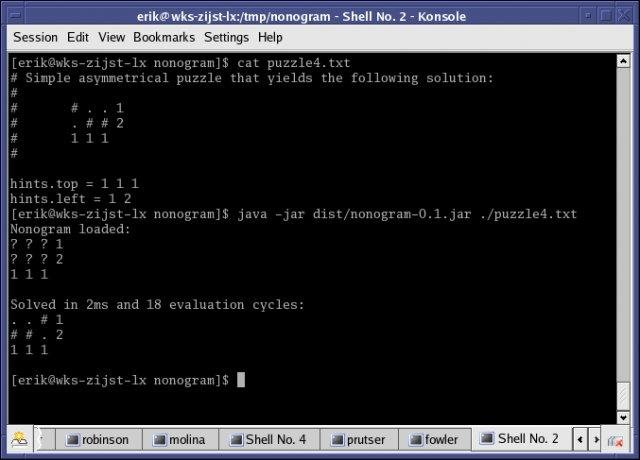
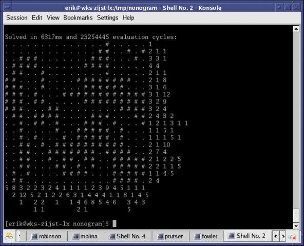

#	Automatic Nonogram Solver

## INTRODUCTION

This package contains a Java program that can automatically solve nonogram
puzzles, AKA Japanese Puzzles.

## USAGE

The distribution comes with a precompiled version of the program, neatly
packaged in a jar file. It requires a 1.5 Java runtime.
The program requires the user to describe the puzzle in a textfile. This file
contains the puzzle's hints. The hints are the numbers that are listed on the
top and left side of the puzzle. You should put these numbers a file the way
it is done in the example puzzles located in the root directory of the
package.

Once the puzzle is described in a textfile, run the following command to solve
the puzzle:

	$ java -jar dist/nonogram-0.1.jar ./puzzle1.txt

This will yield the following output:

	Nonogram loaded:
	? ? ? ? 1
	? ? ? ? 1
	? ? ? ? 1 2
	? ? ? ? 1
	1 1 1 2
	1
	
	
	Solved in 3ms and 307 evaluation cycles:
	# . . . 1
	. . . # 1
	# . # # 1 2
	. # . . 1
	1 1 1 2
	1

The program loads the puzzle from file and first displays it to the screen.
Aside from the fact that your original puzzle may have its hints listed on the
top and left side of the puzzle, the program displays them on the right and
bottom side. This is equivalent.
The program will then immediately start solving the puzzle and print the
solution as soon as it is ready.

October 30th, 2005
Erik van Zijst
nonogram@erik.prutser.cx
